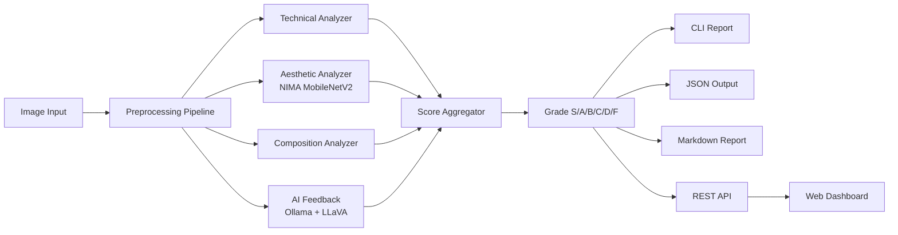

# VisionScore

[](https://www.python.org/downloads/)
[](LICENSE)
[](https://github.com/yourusername/VisionScore/actions)

AI-powered photo evaluation tool that scores images on technical quality, aesthetics, composition, and provides natural language feedback.

## Features

- **Technical Quality** -- Sharpness (Laplacian + Sobel), exposure (LAB histogram), noise (Immerkaer), dynamic range
- **Aesthetic Scoring** -- NIMA (MobileNetV2) trained on AVA dataset with score distribution analysis
- **Composition Analysis** -- Spectral residual saliency, rule of thirds, subject position, horizon, visual balance
- **AI Feedback** -- Ollama + LLaVA for natural language critique, genre classification, strengths/improvements
- **Score Aggregation** -- Weighted scoring with automatic redistribution. Grades: S/A/B/C/D/F
- **CLI Tool** -- Rich terminal output with score bars, JSON, and Markdown reports
- **REST API** -- FastAPI with Supabase persistence, Swagger UI at `/docs`
- **Web Dashboard** -- React + Vite + Tailwind frontend with upload, results, history, and PDF export

## Architecture



## Scoring System

| Category | Weight | Metrics |
|----------|--------|---------|
| Technical Quality | 25% | Sharpness, Exposure, Noise, Dynamic Range |
| Aesthetic Quality | 30% | NIMA score (mapped from AVA 1-10 scale) |
| Composition | 25% | Rule of Thirds, Subject Position, Horizon, Balance |
| AI Feedback | 20% | LLM-extracted quality score |

**Grades:** S (95-100), A (85-94), B (70-84), C (55-69), D (40-54), F (0-39)

Weights are configurable via `--weights` flag or `AnalysisWeights` in config. Missing analyzers have their weight automatically redistributed.

## Quick Start

```bash
# Install backend
pip install -e ".[dev,api]"

# Download NIMA model weights
python scripts/download_models.py

# Analyze a photo
visionscore analyze photo.jpg

# Start the frontend
cd frontend && npm install && npm run dev
```

## CLI Usage

```bash
# Full analysis with rich terminal output
visionscore analyze photo.jpg

# JSON output
visionscore analyze photo.jpg --output json

# Save markdown report
visionscore analyze photo.jpg --save report.md

# Custom weights (technical:aesthetic:composition:ai)
visionscore analyze photo.jpg --weights 30:30:30:10

# Skip AI feedback (no Ollama required)
visionscore analyze photo.jpg --skip-ai

# View image metadata / EXIF
visionscore info photo.jpg
```

## API Usage

```bash
# Start the server
uvicorn visionscore.api.app:app --reload

# Analyze an image
curl -X POST http://localhost:8000/api/v1/analyze -F "file=@photo.jpg"

# Analyze with custom weights, skip AI
curl -X POST "http://localhost:8000/api/v1/analyze?skip_ai=true&weights=30:30:30:10" \
  -F "file=@photo.jpg"

# Health check
curl http://localhost:8000/api/v1/health
```

With Supabase configured (`SUPABASE_URL`, `SUPABASE_KEY` in `.env`):

```bash
# Analyze and persist report
curl -X POST http://localhost:8000/api/v1/analyze/save -F "file=@photo.jpg"

# List saved reports
curl http://localhost:8000/api/v1/reports

# Get specific report
curl http://localhost:8000/api/v1/reports/{id}
```

Full API docs at `http://localhost:8000/docs` (Swagger UI).

## Configuration

Environment variables (or `.env` file):

| Variable | Default | Description |
|----------|---------|-------------|
| `OLLAMA_HOST` | `http://localhost:11434` | Ollama server URL |
| `OLLAMA_MODEL` | `llava` | Vision model for AI feedback |
| `SUPABASE_URL` | (none) | Supabase project URL |
| `SUPABASE_KEY` | (none) | Supabase anon key |
| `API_HOST` | `0.0.0.0` | API server host |
| `API_PORT` | `8000` | API server port |

See `.env.example` for the full template.

## Project Structure

```
src/visionscore/
  analyzers/       # Technical, aesthetic, composition, AI feedback
  pipeline/        # Image loading, metadata, orchestration
  scoring/         # Score aggregation, grading
  output/          # JSON, CLI, markdown reports
  api/             # FastAPI + Supabase client
frontend/          # React + Vite + Tailwind dashboard
tests/             # 155 tests (pytest)
scripts/           # Model download
sql/               # Supabase schema
docs/              # API reference, scoring methodology
```

## Tech Stack

- **Core:** Python 3.11+, PyTorch, OpenCV, Pillow, NumPy
- **Models:** NIMA (MobileNetV2), Ollama + LLaVA
- **CLI:** Typer, Rich
- **API:** FastAPI, Supabase
- **Data:** Pydantic, pydantic-settings
- **Frontend:** React, Vite, Tailwind CSS, shadcn/ui, jsPDF
- **Quality:** pytest, ruff, mypy

## Development

```bash
# Run tests
pytest

# Lint
ruff check src/ tests/

# Format
ruff format src/ tests/

# Type check
mypy src/visionscore/
```

## License

[MIT](LICENSE)
