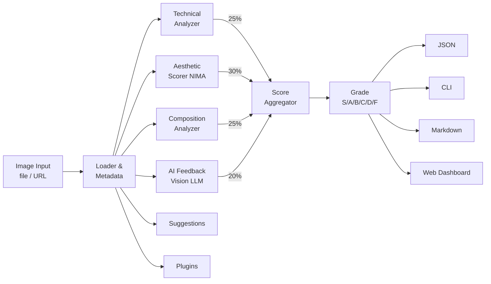

# VisionScore

[](https://www.python.org/downloads/)
[](LICENSE)

AI-powered photo evaluation tool that scores images on technical quality, aesthetics, composition, and provides natural language feedback. Includes a CLI, REST API, and React web dashboard.

## Features

- **Technical Quality** -- Sharpness, exposure, noise, dynamic range analysis
- **Aesthetic Scoring** -- NIMA (MobileNetV2) trained on AVA dataset
- **Composition Analysis** -- Rule of thirds, subject position, horizon, balance via spectral residual saliency
- **AI Feedback** -- Ollama + LLaVA for natural language critique with structured JSON output
- **Improvement Suggestions** -- Structured edit suggestions (crop, exposure, contrast, etc.) with crop preview generation
- **Score Aggregation** -- Weighted scoring with configurable weights, grades S/A/B/C/D/F
- **Comparison & Batch** -- Side-by-side image comparison, directory batch analysis with CSV export
- **Gallery Mode** -- Generate standalone HTML gallery from batch results with POTD hero and rankings
- **Fine-Tuning** -- Train NIMA on your own rated images with EMD loss, augmentation, and LR scheduling
- **Plugin System** -- Extensible analyzer plugins (bundled Instagram Readiness + custom plugin support)
- **REST API** -- FastAPI with Supabase persistence, file uploads up to 20MB, GZip compression, thumbnail generation
- **Mobile-Friendly API** -- API key authentication, per-key rate limiting, webhook notifications (analysis/batch events), HMAC-signed payloads
- **Web Dashboard** -- React + TypeScript + Vite + Tailwind frontend with upload, results, batch, comparison, history, plugin management, training, and API settings UI

## Architecture



## Quick Start

### Backend

```bash
pip install -e ".[dev,api]"
python scripts/download_models.py
cp .env.example .env  # Configure as needed
visionscore analyze photo.jpg
```

### Frontend

```bash
cd frontend
npm install
npm run dev
```

The dashboard runs at `http://localhost:5173` and connects to the API at `http://localhost:8000`.

## CLI Usage

```bash
visionscore analyze photo.jpg                        # Rich terminal output
visionscore analyze photo.jpg --output json          # JSON output
visionscore analyze photo.jpg --save report.md       # Save markdown report
visionscore analyze photo.jpg --weights 30:30:30:10  # Custom weights (t:a:c:ai)
visionscore analyze photo.jpg --skip-ai              # Skip AI feedback
visionscore info photo.jpg                           # EXIF metadata
visionscore compare before.jpg after.jpg             # Compare two images
visionscore analyze-batch photos/ --skip-ai          # Batch analysis
visionscore analyze-batch photos/ --save results.csv # Export CSV
visionscore gallery photos/ --output gallery.html    # HTML gallery
visionscore train photos/ ratings.csv --epochs 20    # Fine-tune NIMA
visionscore plugins                                  # List registered plugins
```

## Training

Fine-tune NIMA on your own rated images (`filename,score` CSV). Trained weights in `~/.visionscore/models/` are loaded automatically.

```bash
visionscore train photos/ ratings.csv --epochs 20
visionscore train photos/ ratings.csv --scale visionscore --full --lr 5e-5
```

Options: `--epochs`, `--batch-size`, `--lr`, `--val-split`, `--full`, `--no-augment`, `--scale`, `--seed`.

Training is also available via the web dashboard and API (`POST /api/v1/train`).

## API

```bash
uvicorn visionscore.api.app:app --reload
```

| Endpoint | Method | Description |
|----------|--------|-------------|
| `/api/v1/analyze` | POST | Analyze a single image |
| `/api/v1/analyze/save` | POST | Analyze and save to Supabase |
| `/api/v1/analyze/upload` | POST | Upload image, get task_id for SSE streaming |
| `/api/v1/analyze/stream/{task_id}` | GET | SSE stream of per-stage analysis progress |
| `/api/v1/batch` | POST | Batch analyze multiple images |
| `/api/v1/compare` | POST | Compare two images |
| `/api/v1/train` | POST | Start NIMA fine-tuning |
| `/api/v1/plugins` | GET | List registered plugins |
| `/api/v1/reports` | GET | Retrieve saved reports |
| `/api/v1/leaderboard` | GET | Ranked image leaderboard |
| `/api/v1/api-keys` | POST/GET/DELETE | API key management (admin) |
| `/api/v1/webhooks` | POST/GET/DELETE | Webhook registration (admin) |
| `/api/v1/uploads/{file}/thumbnail` | GET | Thumbnail generation |

Full Swagger docs at `http://localhost:8000/docs`. Config via env vars or `.env` file -- see `.env.example`.

GZip compression is enabled for all responses above 500 bytes. Thumbnails can be requested with `?width=` parameter.

## Plugins

VisionScore supports analyzer plugins that extend the scoring pipeline. Plugins are `BaseAnalyzer` subclasses with a `plugin_info` class variable.

### Bundled Plugins

- **Instagram Readiness** -- Evaluates aspect ratio, resolution, and saturation for Instagram fit. Enable with `ENABLE_BUNDLED_PLUGINS=true`.

### Creating a Custom Plugin

Create a `.py` file in `~/.visionscore/plugins/` (or set `PLUGIN_DIR`):

```python
from pydantic import BaseModel
from visionscore.analyzers.base import BaseAnalyzer
from visionscore.plugins.info import PluginInfo

class MyResult(BaseModel):
    overall: float = 0.0

class MyPlugin(BaseAnalyzer):
    plugin_info = PluginInfo(name="my_plugin", display_name="My Plugin")

    def analyze(self, image, metadata=None):
        return MyResult(overall=85.0)
```

Plugins can also be distributed as packages using the `visionscore.analyzers` entry-point group. Manage plugins via `visionscore plugins` CLI or the web dashboard.

## Project Structure

```
src/visionscore/
  analyzers/       # Technical, aesthetic, composition, AI feedback analyzers
  pipeline/        # Image loading, metadata extraction, orchestration
  scoring/         # Score aggregation, grading (S/A/B/C/D/F)
  output/          # CLI, JSON, markdown, CSV, comparison formatters
  training/        # NIMA fine-tuning with EMD loss
  plugins/         # Plugin registry + bundled Instagram plugin
  api/             # FastAPI routes + Supabase client
  cli.py           # Typer CLI (7 commands)
  config.py        # Settings loaded from .env
  models.py        # Pydantic data models
frontend/          # React 18 + TypeScript + Vite + Tailwind dashboard
tests/             # 28 pytest test files
scripts/           # Model download utility
```

## Configuration

Copy `.env.example` to `.env` and configure:

- **Ollama** -- Host and model for AI feedback (default: `llava`)
- **Supabase** -- URL and keys for cloud persistence
- **Models** -- Weight directory, custom model path, device (auto/cpu/cuda/mps)
- **Plugins** -- Enable bundled plugins, set custom plugin directory

## Development

```bash
# Backend
pytest                          # Run tests
ruff check src/ tests/          # Lint
ruff format src/ tests/         # Format
mypy src/visionscore/           # Type check

# Frontend
cd frontend
npm run dev                     # Dev server
npm run build                   # Production build
npm run lint                    # ESLint
```

## License

[MIT](LICENSE)
